<h1 align="center">⚙️ Azure DevOps CI/CD Assessment ⚙️</h1>

## 📖 Project Overview

This project demonstrates a complete CI pipeline for a Spring Boot application using Azure DevOps. The application is containerized with Docker, analyzed for code quality using SonarCloud, scanned for vulnerabilities using Trivy, deployed to Kubernetes, and monitored using Prometheus and Grafana.


## 🛠️ Technologies Used

* Azure DevOps
* Azure Pipelines (YAML Templates)
* Self-hosted Agent
* Java 17
* Spring Boot
* Maven
* Docker
* Docker Hub
* Kubernetes
* Bitnami Sealed Secrets
* SonarCloud
* Trivy
* Prometheus
* Grafana

## 🏗️  Architecture

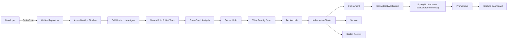

## 📑 Steps 
### 1. 🖥️ Run the Application Locally

Before implementing the CI/CD pipeline, the Java Spring Boot application was verified by running it locally to ensure it was functioning correctly.

The application is configured to run on **port 8080** using the following Spring Boot configuration:

```properties
server.port=8080
```

After starting the application, it can be accessed at:

```text
http://localhost:8080/
```

The root endpoint (`/`) returns the following response:

```text
Hello from Azure DevOps Assessment!
```

The application also exposes Spring Boot Actuator endpoints required for monitoring:

* `/actuator/health` – Application health status
* `/actuator/info` – Application information
* `/actuator/prometheus` – Prometheus metrics endpoint

These endpoints are enabled through the application's configuration and will later be used by the monitoring stack (Prometheus and Grafana).

# 2. 🐳 Containerizing the Application

To ensure the application runs consistently across different environments, it was containerized using a **multi-stage Docker build**.

The Dockerfile follows containerization best practices by:

* Using a **multi-stage build** to reduce the final image size.
* Building the application with **Maven 3.9** and **Eclipse Temurin JDK 17**.
* Running the application on a lightweight **Eclipse Temurin JRE 17** runtime image.
* Executing the application as a **non-root user** to improve container security.
* Exposing **port 8080** for application access.

### Build the Docker Image

Run the following command to build the Docker image:

```bash
docker build -t assesment:v1 .
```

### Run the Docker Container

Start the container and map the application's port to the host machine:

```bash
docker run -d --name assesment -p 8080:8080 assesment:v1
```

### Verify the Application

Once the container is running, open:

```text
http://localhost:8080/
```

The application should return:

```text
Hello from Azure DevOps Assessment!
```

You can also verify the monitoring endpoint exposed by Spring Boot Actuator:

```text
http://localhost:8080/actuator/prometheus
```

Successfully running the application inside a Docker container confirms that the application is fully containerized and ready for the CI/CD pipeline, where the same image will be built, scanned for vulnerabilities, and published to the container registry.

## 3. ☁️ Azure DevOps Pipeline

After validating the application locally and inside a Docker container, an automated CI/CD pipeline was implemented using **Azure DevOps Pipelines**.

To improve maintainability and follow Infrastructure as Code (IaC) best practices, the pipeline was designed using **reusable YAML templates** instead of placing all stages in a single file.

The pipeline consists of:

* A main pipeline (`azure-pipelines.yml`) responsible for triggering the workflow and defining shared variables.
* A **Build** template responsible for compiling the application, running tests, performing code quality analysis, and publishing the build artifact.
* A **Docker** template responsible for building the Docker image, performing a security scan with Trivy, and pushing the image to Docker Hub.

This modular approach makes the pipeline easier to maintain, reuse, and extend for future projects.

---

### 3.1 🔗 Azure DevOps Service Connections

Before running the pipeline, the required service connections were configured in Azure DevOps.

#### Docker Hub Service Connection

A Docker Hub service connection was created to allow Azure DevOps to authenticate securely and push container images to the Docker Hub repository.

The pipeline uses this service connection during the image publishing stage instead of storing credentials inside the repository.
##### 📸 DockerHub Connection

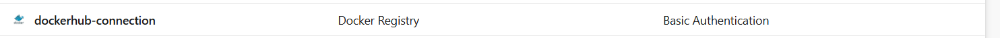
#### SonarCloud Service Connection

A SonarCloud service connection was also configured to enable automated code quality analysis directly from the pipeline.

Authentication is handled securely through Azure DevOps service connections without exposing tokens in the source code.
##### 📸 SonarCloud Connection

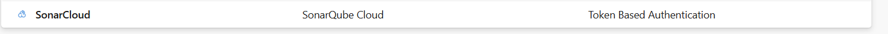

---

### 📂 Pipeline Structure

```text
azure-pipelines.yml
│
└── azure-pipelines/
    └── templates/
        ├── build.yml
        └── docker.yml
```

The main pipeline triggers on every push to the **main** branch and references the reusable pipeline templates responsible for each stage of the CI workflow.


### 3.2 🏗️ Build Stage

The **Build** stage is responsible for validating the application before any container image is created.

The stage performs the following tasks:

* Checks out the source code.
* Restores and caches Maven dependencies to speed up subsequent builds.
* Compiles the Spring Boot application.
* Executes unit tests using Maven.
* Runs a SonarCloud code quality analysis.
* Evaluates the SonarCloud Quality Gate.
* Publishes test results.
* Publishes the generated JAR file as a build artifact.

#### 🔍 SonarCloud Integration

Code quality analysis is integrated directly into the CI pipeline using **SonarCloud**.

During each pipeline execution, SonarCloud analyzes the Java source code and evaluates:

* Bugs
* Vulnerabilities
* Code Smells
* Security Hotspots
* Code Coverage
* Maintainability
* Reliability

The pipeline waits for the Quality Gate result before continuing.

If the configured Quality Gate fails (for example, due to blocker or critical issues), the pipeline can be configured to stop before continuing to the next stages.

The analysis results can be viewed from:

* Azure DevOps Pipeline Summary
* SonarCloud Project Dashboard

This ensures that only code meeting the defined quality standards proceeds through the CI/CD workflow.

##### 📸 SonarCloud Dashboard

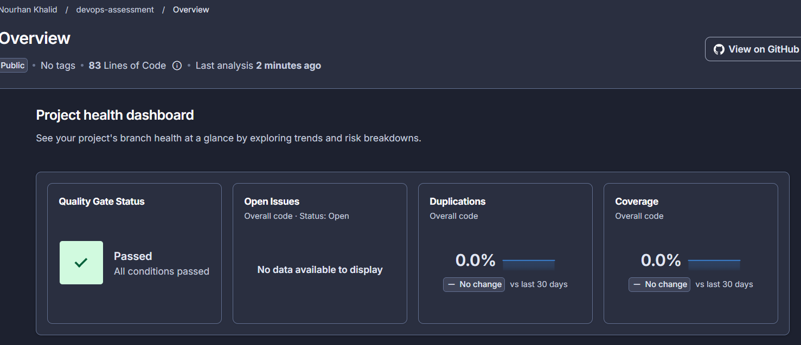

### 3.3 🐳 Docker Build, Security Scan & Image Publishing

Once the build and code quality validation complete successfully, the pipeline proceeds to the Docker stage.

This stage performs the following tasks:

1. Builds the Docker image using the project's Dockerfile.
2. Tags the image using both the Azure DevOps Build ID and the `latest` tag.
3. Performs an automated security vulnerability scan using **Trivy**.
4. Pushes the verified image to Docker Hub.


### 3.4 🛡️ Trivy Vulnerability Scanning

Before publishing the Docker image, the pipeline automatically scans the image using **Trivy**.

The scan checks both:

* Operating system packages
* Application dependencies

The pipeline is configured to report **High** and **Critical** vulnerabilities before the image is published.

This automated security scan helps identify vulnerable packages early in the CI pipeline and supports DevSecOps best practices.

#### 📸 Trivy Checks

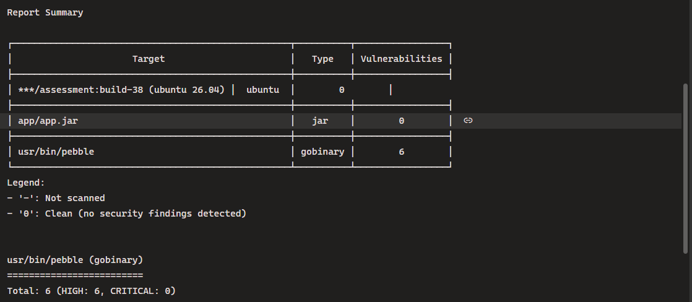

### 3.5 📦 Docker Hub Publishing

After the security scan completes successfully, the Docker image is pushed automatically to the configured Docker Hub repository.

Each build publishes:

* A unique image tagged with the Azure DevOps Build ID.
* A `latest` tag representing the newest successful build.

This ensures versioned images are always available while maintaining a stable latest release.

#### DockerHub

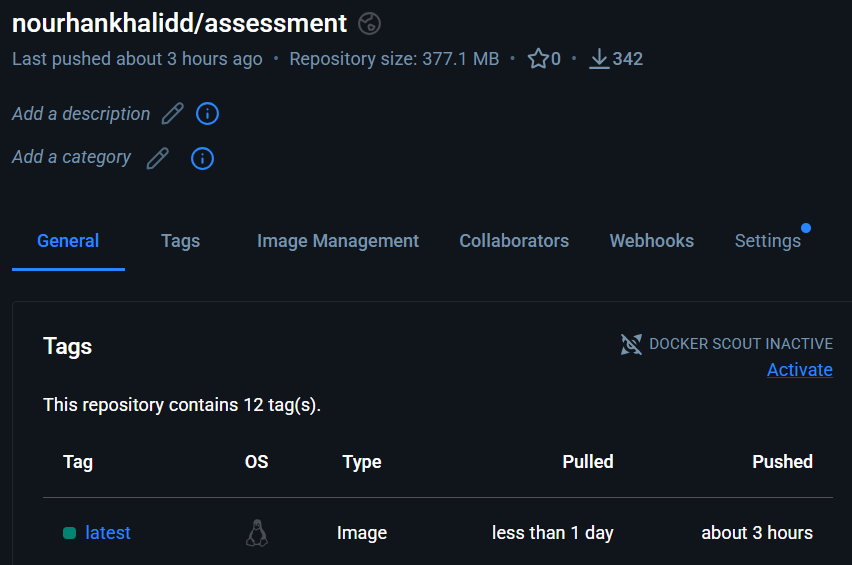

## 📸 Pipeline Successfully
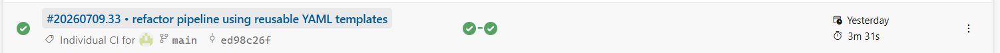

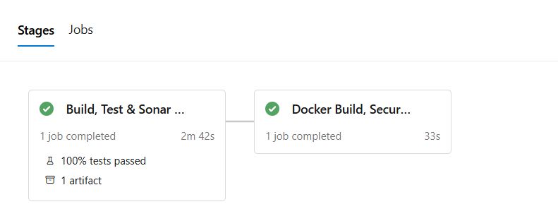

## 4. 🖥️ Configuring a Docker-Based Self-Hosted Azure DevOps Agent

To execute the CI/CD pipeline in a controlled and reproducible environment, a **self-hosted Linux build agent** was configured and registered with Azure DevOps.

Instead of using Microsoft-hosted agents, a dedicated Linux agent was deployed to provide full control over the build environment and allow the installation of all required tools, including Docker, Maven, Java, and Trivy.

### Configuration Steps

1. Created a new **Agent Pool** in Azure DevOps.
2. Generated the agent registration script from the Azure DevOps project.
3. Installed and configured the Azure Pipelines Linux agent.
4. Registered the agent with the newly created Agent Pool.
5. Started the agent service and verified that its status changed to **Online**.
6. Updated the pipeline to use the self-hosted Linux agent pool instead of a Microsoft-hosted agent.

After the agent became available, Azure DevOps automatically scheduled pipeline jobs on the self-hosted machine, where all build, analysis, security scanning, and Docker operations were executed successfully.

### Verification

The successful configuration was verified by:

* The agent appearing with an **Online** status in Azure DevOps.
* Pipeline jobs being assigned automatically to the self-hosted Linux agent.
* Successful execution of all pipeline stages using the configured agent.


The screenshot below shows the Linux agent in the **Online** state and successfully performing the pipeline tasks.

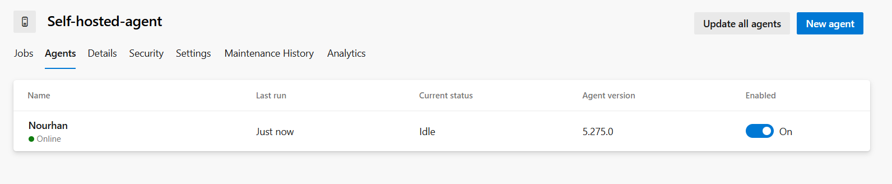

### 5. ☸️ Kubernetes Deployment

After successfully building and publishing the Docker image, the application was deployed to a Kubernetes cluster.

The deployment consists of two Kubernetes resources:

### Deployment

A Kubernetes **Deployment** was created to manage the application pods.

The deployment configuration includes:

* Two application replicas for high availability.
* The latest Docker image published from the CI pipeline.
* Resource requests and limits for CPU and memory.
* Readiness and Liveness probes using the Spring Boot Actuator health endpoint.
* Environment variables loaded securely from Kubernetes Secrets.

The health probes continuously monitor the application and automatically restart unhealthy containers when required.

### Service

A Kubernetes **NodePort Service** was created to expose the application outside the cluster.

The service forwards incoming traffic from port **80** to the application running on **port 8080** inside the containers, allowing external clients to access the application.

#### 📸 Verify K8s
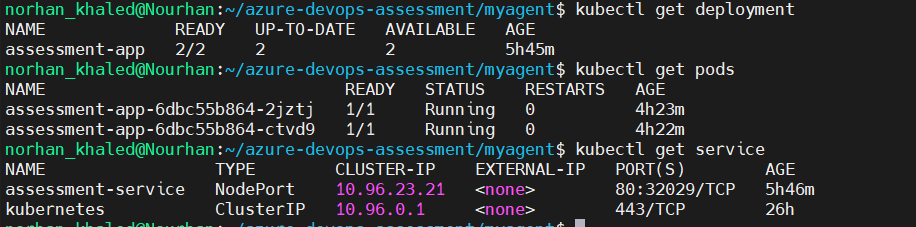


### 6. 🔐 Secure Secret Management with Sealed Secrets

To follow DevSecOps security best practices, sensitive application secrets were **not committed to GitHub as plain Kubernetes Secrets**.

Instead, **Bitnami Sealed Secrets** was used to encrypt the secret before storing it in the repository.

#### Why Sealed Secrets?

A standard Kubernetes Secret is only Base64-encoded, which means anyone with repository access could easily decode its contents if it were committed to source control.

A Sealed Secret, however, is encrypted using the public key of the Sealed Secrets controller. Only the controller running inside the Kubernetes cluster can decrypt it and recreate the original Kubernetes Secret.

This approach enables GitOps workflows while keeping sensitive information protected.

#### Creating the Secret

The secret was first created locally using `kubectl`:

```bash
kubectl create secret generic assessment-secret \
  --from-literal=APP_SECRET=<your-secret> \
  --dry-run=client -o yaml > secret.yaml
```

#### Encrypting the Secret

The secret was then encrypted using **kubeseal**:

```bash
kubeseal \
  --format yaml \
  < secret.yaml \
  > sealed-secret.yaml
```

This generated a `SealedSecret` resource containing encrypted data.

After verifying that the encrypted file was created successfully:

* `secret.yaml` was deleted.
* Only `sealed-secret.yaml` was committed to the Git repository.

When the Sealed Secrets controller detects the `SealedSecret` resource inside the cluster, it automatically recreates the original Kubernetes Secret.

This ensures that no plaintext secrets are ever stored in version control while still allowing fully automated Kubernetes deployments.

### 7. 📊 Monitoring & Observability

To monitor the deployed Spring Boot application, a lightweight observability stack was configured using **Prometheus** and **Grafana**.

The application exposes runtime metrics through the Spring Boot Actuator Prometheus endpoint:

```text
http://localhost:8080/actuator/prometheus
```

Prometheus periodically scrapes these metrics, while Grafana visualizes them through interactive dashboards.

#### Architecture

The monitoring workflow is as follows:

```text
Spring Boot Application
        │
        ▼
/actuator/prometheus
        │
        ▼
Prometheus
        │
        ▼
Grafana Dashboard
```

#### Docker Compose

The monitoring stack was deployed using Docker Compose, which starts both Prometheus and Grafana containers.

Start the monitoring stack:

```bash
docker compose up -d
```

Verify the running containers:

```bash
docker ps
```

Stop the monitoring stack:

```bash
docker compose down
```

#### Prometheus Configuration

Prometheus is configured to scrape the Spring Boot application's metrics endpoint every **15 seconds**.

The metrics are collected from:

```text
host.docker.internal:8080/actuator/prometheus
```

#### Grafana Dashboard

Grafana was connected to Prometheus as its data source, and a custom dashboard was created to visualize the application's runtime metrics.

The dashboard provides real-time monitoring of:

* CPU Usage
* Memory Usage
* Application Uptime

These metrics help monitor application health, resource consumption, and overall runtime performance.

### Access the Monitoring Tools

Prometheus:

```text
http://localhost:9090
```

Grafana:

```text
http://localhost:3000
```

The Grafana dashboard automatically retrieves data from Prometheus and displays live metrics collected from the Spring Boot application.
#### 📸 Prometheus 

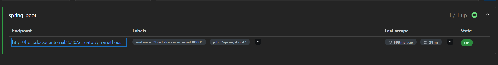

#### 📸 Custom Grafana Dashboard

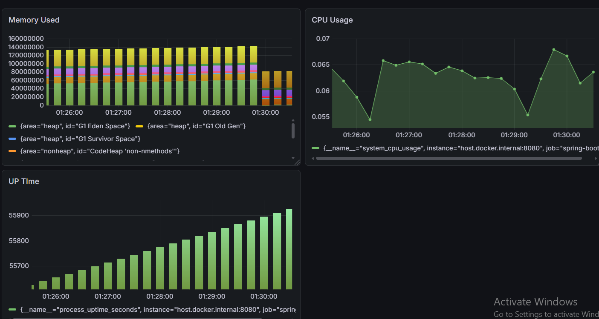


## 👩‍💻 Author
### Nourhan Khalid


